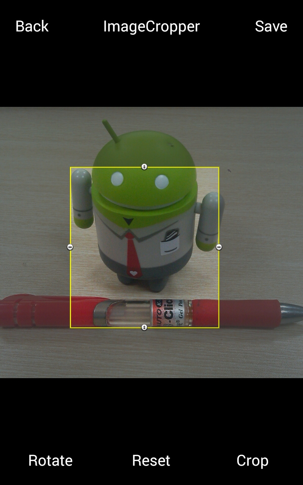

ImageCropper
=========
A custom image cropper library on Android

Features
=========
- Support moving/scale the crop window freely by finger
- Support set a fixed crop window size
- Support set the max crop window size
- Support set a fixed crop window's width/height aspect
- Support rotate the image when cropping
- Easy to integrate into your app

ScreenShot
=========


Dependency 
=========
(1) Add it in your root build.gradle at the end of repositories:
```groovy
allprojects {
    repositories {
        ...
        maven { url "https://jitpack.io" }
    }
}
```

(2) Add the dependency
```groovy
allprojects {
    compile 'com.github.Jhuster:ImageCropper:v1.1.1'
}
```

Usage
=========
Declare the CropImageActivity in the main project's AndroidManifest.xml
```xml
<activity android:name="com.jhuster.imagecropper.CropImageActivity"/>
```

Declare the write_external_storage permission in the main project's AndroidManifest.xml
```xml
<uses-permission android:name="android.permission.WRITE_EXTERNAL_STORAGE" />
```

Call these methods to run CropImage Activity

```java
//1. Using the CropIntent to help build the start intent
private void startCropImage() {

    // Create a CropIntent
    CropIntent intent = new CropIntent();

    // Set the source image filepath/URL and output filepath/URL (Optional)
    //intent.setImagePath("/sdcard/source.jpg");
    intent.setOutputPath("/sdcard/cropped.jpg");

    // Set a fixed crop window size (Optional)
    //intent.setOutputSize(640,480);

    // set the max crop window size (Optional)
    //intent.setMaxOutputSize(800,600);

    // Set a fixed crop window's width/height aspect (Optional)
    //intent.setAspect(3,2);

    // start ImageCropper activity with certain request code and listen for result
    startActivityForResult(intent.getIntent(this), 0);
}
```

Waiting for result
```java
@Override
protected void onActivityResult(int requestCode, int resultCode, Intent data) {

    if (resultCode != RESULT_OK) {
        return;
    }

    if (requestCode == 0) {
        Uri croppedUri = data.getExtras().getParcelable(MediaStore.EXTRA_OUTPUT);
        InputStream in = null;
        try {
            in = getContentResolver().openInputStream(croppedUri);
            Bitmap b = BitmapFactory.decodeStream(in);
            //mImageView.setImageBitmap(b);
        }
        catch (FileNotFoundException e) {
            e.printStackTrace();
        }
    }
    super.onActivityResult(requestCode, resultCode, data);
}
```

Contact
----------
Email：lujun.hust@gmail.com


